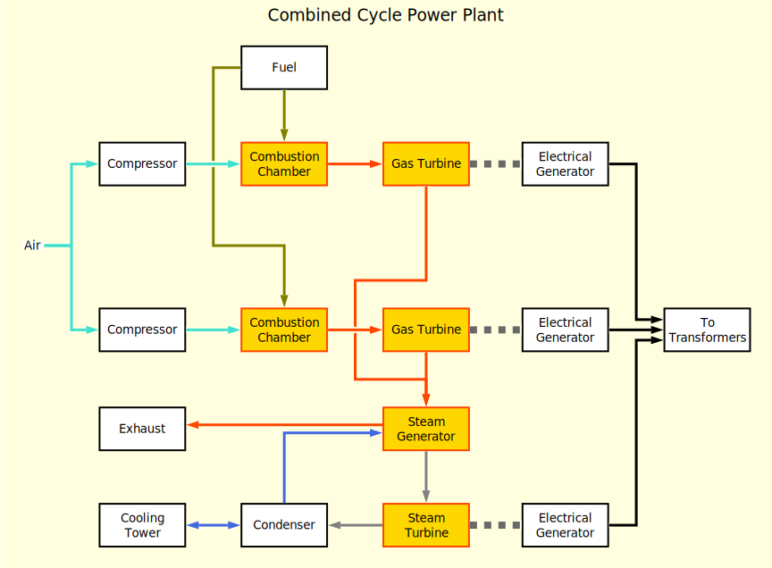

=========
Orthogram
=========

**WARNING:** *This is work in progress.  There is no guarantee as to
the stability and reliability of this program.  Use at your own risk.*

Orthogram is a command line program and Python library that lets you
draw diagrams of graphs.  It reads a YAML file and produces a SVG file
like this one:

Orthogram does not aim to be a fully-featured graph layout solution.
Actually, it offers just a single layout: grid.  More than that, you
have to arrange the *nodes* (i.e. graph vertices) manually in the grid
and they stay fixed in place; the program will not attempt to move
them around trying to optimize any aspect of the diagram.  Styling is
also rather basic at the moment.  It does however try to do a decent
job arranging the *links* (i.e. graph edges) around the nodes to
produce a tidy, readable drawing.

When used as a command line tool, Orthogram reads a *diagram
definition file* and produces a Scalable Vector Graphics file.  The
definition file is written in YAML.

Installation
------------

You must have Python 3.8 or newer installed in your system.  Run the
following command to install package ``orthogram`` from PyPi:

.. code:: sh

   python -m pip install orthogram

Note however that some of Orthogram's dependencies rely on C/C++
libraries that you may have to install on your system:

=================  ===========
Python Package     Library
=================  ===========
``python-igraph``  igraph
``pyyaml``         LibYAML
``shapely``        GEOS
=================  ===========

Command line interface
----------------------

The ``orthogram`` module is designed to be used from the command line.
To generate a drawing of a diagram defined in a `diagram definition
file`_ named ``diagram.yaml``, enter the following command:

.. code:: sh

   python -m orthogram diagram.yaml

This will create a ``diagram.svg`` file in the same directory.  If you
wish to create a file with a different name or in a different
directory, pass the path as a second argument.

The program creates Scalable Vector Graphics (SVG) files.  Use your
web browser to view the drawing.  Use `Inkscape`_ to convert it to PNG
or other supported formats.

.. _Inkscape: https://inkscape.org

Hello world
-----------

Start the text editor of your choice and type in the following lines
of YAML:

.. code:: yaml

   nodes:
     a:
       label: Hello
     b:
       label: world
   rows:
     - nodes: [a]
     - nodes: ["", b]
   links:
     - start: a
       end: b

Save it as ``hello.yaml`` and run:

.. code:: sh

   python -m orthogram hello.yaml

This should create a ``hello.svg`` file in the same directory.

Diagram definition file
-----------------------

Orthogram uses YAML for its input file format.  Of course, YAML being
a superset of JSON, you can use JSON if you prefer so.  The top-level
structure must be a YAML mapping; the following keys are recognized,
each one containing a different category of definitions:

* ``diagram``
* ``nodes``
* ``rows``
* ``links``
* ``styles``
* ``groups``

``diagram``
~~~~~~~~~~~

The ``diagram`` section contains the `attributes`_ of the diagram
itself.  It is entirely optional; you do not need one if you do not
intend to customize your diagram.  Here is an example of a ``diagram``
section:

.. code:: yaml

   diagram:
     label: This is my diagram!
     font_weight: bold

The following diagram attributes are of particular significance:

``collapse_links``
  If you set this to ``true``, collinear segments of links belonging
  to the same ``group`` will collapse into a single segment.  This may
  help reduce the clutter, though it depends on the application.  Try
  it out and see.

``stretch``
  By default, the diagram resizes itself to fill the element that
  contains it.  Set this attribute to ``false`` to make the browser
  render the diagram in its original dimensions.

``nodes``
~~~~~~~~~

The ``nodes`` section contains mappings between node names and node
definitions.  You must have at least a couple of nodes to produce a
meaningful diagram.  Here is an example:

.. code:: yaml

   nodes:
     a:
       label: A node
     b:
       label: Another node
       stroke: blue

If you want a label with more than one line of text, use the newline
character in the string.  Even better, you can use the YAML literal
style:

.. code:: yaml

   nodes:

     single-line:
       label: A single line label

     multi-with-newlines:
       label: Two lines separated by\na newline character

     multi-with-newlines-again:
       label: |-
         You can also use
	 YAML literal style

Note that if the label of a node is not defined, the name of the node
is used as a label instead.

``rows``
~~~~~~~~

The ``rows`` section of the diagram definition file is used to arrange
the nodes in the layout grid.  It is essential; nodes that have not
been placed in the grid are not drawn at all.

The ``rows`` structure is a sequence of row definitions.  Each row
definition contains a sequence of node names.  You can use an empty
string between the node names to leave an empty spot in the row.  Here
is an example:

.. code:: yaml

   nodes:
     a:
     b:
     c:
   rows:
     - nodes: [a]
     - nodes: [b, "", c]

Note that the ``nodes`` key is necessary.  Row definitions do not have
any attributes, though this may change in the future.

``links``
~~~~~~~~~

The ``links`` section defines the connections between the nodes.  It
is a sequence of link definitions. Each link must declare the names of
the ``start`` and ``end`` nodes, as well as any `attributes`_
appropriate for links.  Note that the nodes must be in place before
making a connection. Here is an example:

.. code::

   nodes:
     a: {label: First node}
     b: {label: Second node}
     c: {label: Third node}
   rows:
     - nodes: [a,  b]
     - nodes: ["", c]
   links:
     - start: a
       end: b
       stroke: blue
     - start: b
       end: c
       stroke: "#FF8844"

Note that the ``start`` and ``end`` values of a link definition can be
*sequences* of node names as well.  This lets you make multiple
connections in a single definition, all links sharing the same
attributes.  For example, the following definition creates six links:

.. code::

   links:
     - start: [a, b]
       end: [c, d, e]

Of particular interest is the ``drawing_priority`` attribute.  Links
with a higher priority number are drawn over links with a lower
priority.  Since the intersection of links cannot typically be avoided
in complex diagrams, it is advised that you draw intersecting links
with a different ``stroke`` color to make obvious that the links are
not connected at the intersection points.  The ``drawing_priority``
lets you draw sets of links as layers on top of each other, giving a
more consistent look to your diagram.

Another way to avoid intersecting links appearing as if the were
connected at the intersections is to draw a *buffer* around the links.
Attributes ``buffer_fill`` and ``buffer_width`` control the appearance
of the buffer.  By default, the program draws the links without a
buffer.

Links may have an additional ``group`` attribute, which works together
with the ``collapse_links`` diagram attribute.  If ``collapse_links``
is set to true, links of the same group that run along the same axis
can be drawn on top of each other, thus reducing the clutter and size
of the diagram.  The ``group`` value is just a string.  Note that
setting this attribute affects the drawing priority of the links.  All
links in the same group must share the same priority, which is the
highest priority among all links in the group.

``styles``
~~~~~~~~~~

You can add style definitions to the ``styles`` section to create
named styles that can be referred to by the nodes and links.  Each
style definition consists of attribute key-value pairs.  For example,
the following two nodes are drawn in the same color:

.. code:: yaml

   nodes:
     a:
       style: reddish
     b:
       style: reddish
   rows:
     - nodes: [a, b]
   styles:
     reddish:
       stroke: "#880000"
       stroke_width: 3.0
       fill: "#FFDDDD"

Attributes defined in the element itself override the attributes
inherited by the linked named style.

There are two special style names, ``default_node`` and
``default_link``, which are used to set default values for all the
nodes and links in the diagram respectively.

``group``
~~~~~~~~~

The ``group`` section may be used to attach attributes to link groups.
Since links in the same group may collapse on one another, it is
usually desirable for all the links in one group to share the same
attributes.  In the example that follows, all links are drawn in blue:

.. code:: yaml

   groups:
     water:
       stroke: blue
       stroke_width: 4.0
   links:
     - start: a
       end: b
       group: water
     - start: c
       end: d
       group: water

A ``group`` definition may contain a reference to a named ``style`` if
needed.  Note that creating an entry in the ``groups`` section is not
necessary for the grouping of the links; a common ``group`` name in
each link definition is sufficient.

Attributes
----------

The following table summarizes the attributes available to the diagram
and its components.  Where an attribute is applicable, it shows the
default value:

====================  ===============  =======  =======
Attribute   	      Diagram  	       Node     Link
====================  ===============  =======  =======
``arrow_back``                 	                False
``arrow_forward``              	                True
``buffer_fill``                                 "none"
``buffer_width``                                0.0
``collapse_links``    False
``column_margin``     24.0
``drawing_priority``           	                0
``end_bias``                                    None
``fill``              "none"   	       "none"
``font_family``       None     	       None     None
``font_size``         14.0     	       10.0
``font_style``        None     	       None     None
``font_weight``       None     	       None     None
``group``                                       None
``label_distance``    6.0
``label_position``    "top"
``label``             None             None
``link_distance``     4.0
``min_height``        300.0            48.0
``min_width``         300.0            96.0
``padding``           24.0
``row_margin``        24.0
``start_bias``                                  None
``stretch``           True
``stroke_dasharray``  None     	       None     None
``stroke_width``      0.0      	       2.0      2.0
``stroke``  	      "none"   	       "black"  "black"
``text_fill``         "black"  	       "black"
``text_line_height``  1.25     	       1.25
====================  ===============  =======  =======

The options for the enumerated attributes are:

* ``label_position``:

  * ``bottom``
  * ``top``

* ``start_bias`` and ``end_bias``:

  * ``horizontal``
  * ``vertical``

API
---

Using the ``Diagram`` class
~~~~~~~~~~~~~~~~~~~~~~~~~~~

If you want to create a diagram using Python, you can start by
creating an empty ``Diagram`` object:

.. code:: python

   from orthogram import Diagram, write_svg

   diagram = Diagram(label="A hand-made diagram", text_fill="blue")

You can pass any diagram `attributes`_ to the constructor as key-value
pairs.

You can now add nodes to the diagram:

.. code:: python

   diagram.add_node("a", label="Hello")
   diagram.add_node("b", label="Beautiful")
   diagram.add_node("c", label="World")

Again, you can provide `attributes`_ for the node as key-value pairs.

In order to use the nodes, you must first place them in the grid:

.. code:: python

   diagram.add_row(["a"])
   diagram.add_row(["b", "", "c"])

The ``add_row`` method takes a list of node names.  Note that you must
have added the nodes to the diagram before placing them in the grid.
Use an empty string or None to leave an empty space between nodes.

After placing the nodes, you can connect them via links like this:

.. code:: python

   diagram.add_link("a", "b", stroke="red")

Note that the ``Diagram`` class offers an ``add_links`` method as
well, which lets you create links en masse (all having the same
attributes).

After you have finished building your diagram, use the ``write_svg()``
function to write the SVG file:

.. code:: python

   write_svg(diagram, "hello.svg")

Using the ``Builder`` class
~~~~~~~~~~~~~~~~~~~~~~~~~~~

The ``Builder`` class lets you create ``Diagram`` objects from Python
dictionaries like the ones you load from a YAML file.  The ``add()``
method imports a complete diagram definition into the builder:

.. code:: python

   import yaml
   from orthogram import Builder, write_svg

   builder = Builder()
   with open("diagram.yaml") as f:
       data = yaml.safe_load(f)
       builder.add(data)
   write_svg(builder.diagram, "diagram.svg")

If you have to be more specific, ``Builder`` provides the following
methods:

=======================  ===============
Do one                   Do many
=======================  ===============
``add_style()``          ``add_styles()``
``add_group()``          ``add_groups()``
``add_node()``           ``add_nodes()``
``add_row()``            ``add_rows()``
``add_link()``           ``add_links()``
``configure_diagram()``
=======================  ===============

For example:

.. code:: python

   node_def = {
       'label': "Hello",
       'fill': "yellow",
       'stroke': "none",
   }
   builder.add_node('hello', node_def)

Use the ``help()`` Python function to read the documentation of each
method.  Note that you have to do the imports in a logical order: you
must import the styles before using them, place the nodes before
linking them etc.

The ``diagram`` property of a ``Builder`` object holds the diagram
which is being built.  If you want to use the ``Diagram`` API on it,
as described in the previous section, after or while using the
builder, you can certainly do so.

Convenience functions
~~~~~~~~~~~~~~~~~~~~~

The ``load_ddf()`` and ``convert_ddf()`` functions are provided as
shortcuts:

.. code:: python

   from orthogram import convert_ddf, load_ddf, write_svg

   # You can do this:
   diagram = load_ddf("diagram.yaml")
   write_svg(diagram, "diagram.svg")

   # or just this:
   convert_ddf("diagram.yaml", "diagram.svg")
