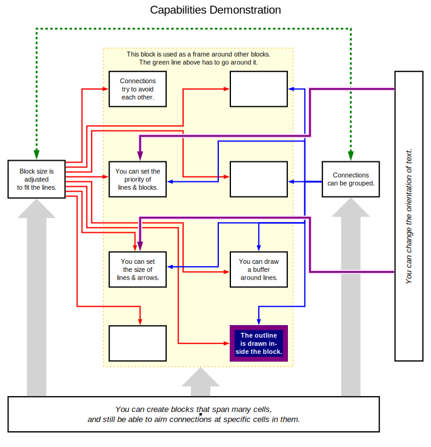
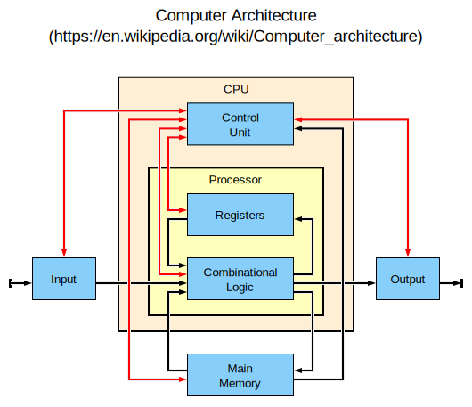
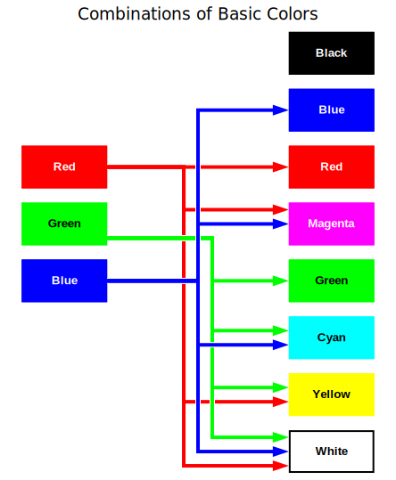

Gallery
=======

Hello
-----

Showing off
-----------

Computer architecture
---------------------

Reproduction of the original from a Wikipedia `article`_:

.. _article: https://en.wikipedia.org/wiki/Computer_architecture

Power plant
-----------

.. image:: ../examples/powerplant.svg
   :width: 100%
   :alt: (Diagram of a combined cycle power plant)

Colors
------

